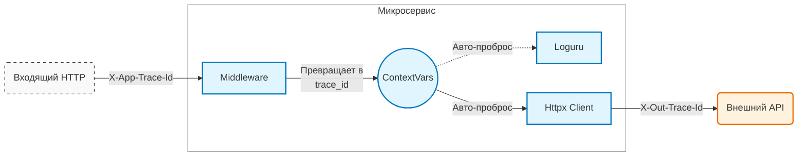

# fast-context 🚀

**Прозрачный проброс контекста (метаданных) между микросервисами на Python.**

Библиотека решает проблему передачи сквозных данных (таких как `request_id`, `user_id`, `trace_id`) через всю цепочку вызовов в асинхронных приложениях без необходимости передавать их явно в аргументах каждой функции.

Она связывает `ContextVars`, HTTP-клиент `httpx`, логирование (например, `loguru`) и фреймворк `FastAPI` в единый механизм.



## ✨ Возможности

*   **Zero-boilerplate:** Не нужно менять сигнатуры функций.
*   **Async-safe:** Построено на нативных `contextvars` — контекст изолирован для каждой Task (запроса).
*   **HTTPX Integration:** Автоматическое внедрение хедеров во все исходящие запросы клиента `httpx`.
*   **FastAPI Middleware:** Автоматическое извлечение хедеров из входящих запросов и помещение их в контекст.
*   **Aggregator:** Удобная работа одновременно с логгером (например, `loguru`) и HTTP-контекстом через единый интерфейс.
*   **Smart Naming:** Автоматическая конвертация `X-Header-Case` ↔ `snake_case`.

## 📦 Установка

Поскольку библиотека не опубликована в PyPI, её можно установить напрямую из репозитория GitHub.

### Через pip

```bash
pip install git+https://github.com/tastydata0/fast-context.git
```

### Через uv

1. В секцию `dependencies` добавьте только название пакета:

```toml
[project]
dependencies = [
    "fast-context",
]
```

2. В секцию `[tool.uv.sources]` укажите, откуда его брать:

```toml
[tool.uv.sources]
fast-context = { git = "https://github.com/tastydata0/fast-context.git", branch = "main" }
```

> Для продакшена вместо `branch = "main"` лучше указывать конкретный тег (`tag = "v0.1.0"`) или хеш коммита (`rev = "a1b2c3d"`), чтобы код внезапно не поменялся.

---

## 🛠 Как это работает

1.  **Входящий запрос:** Middleware ловит хедеры с определенным префиксом (например, `X-App-Request-ID`) и сохраняет их в контекст как `request_id`.
2.  **Внутри приложения:** Логгер автоматически подхватывает эти переменные (если используется агрегатор).
3.  **Исходящий запрос:** Пропатченный `httpx` клиент читает контекст, преобразует `request_id` обратно в `X-Context-Request-ID` (префикс настраивается) и отправляет запрос дальше.

---

## 📖 Примеры использования

### 1. Клиентская часть: Отправка запросов

Здесь мы создаем контекст вручную и делаем запросы. Библиотека сама прокинет данные в хедеры.

```python
import httpx
from fast_context import ContextVarsManager, ContextManagerAggregator
from loguru import logger

# 1. Менеджер, который хранит контекст (поверх contextvars)
manager = ContextVarsManager()

# 2. Агрегатор. Он нужен, чтобы одной строчкой обновлять контекст 
# и для HTTP-клиента, и для Логгера (loguru).
# (Любой объект с методом contextualize(**kwargs) подойдет)
ctx = ContextManagerAggregator(manager, logger)

# 3. Создаем стандартный httpx клиент
http_client = httpx.AsyncClient()

# 4. "Магия": Патчим клиент.
# Теперь он будет смотреть в manager и добавлять хедеры с префиксом "x-app-"
manager.inject_to_client(http_client, prefix="x-app-")

async def main():
    # Устанавливаем request_id и user_id.
    # Они попадут и в логи, и в исходящие хедеры.
    with ctx.contextualize(request_id="req-123", user_id="user-1"):
        logger.info("Doing work...") 
        
        # Исходящий запрос будет содержать хедеры:
        # x-app-request-id: req-123
        # x-app-user-id: user-1
        await http_client.get("http://localhost:8000/")

        # Вложенный контекст (мержится с родительским)
        with ctx.contextualize(trace_id="trace-999"):
            # Хедеры здесь: request-id, user-id И trace-id
            await http_client.get("http://localhost:8000/nested")

    # Здесь контекст чист
    await http_client.get("http://localhost:8000/clean")
```

### 2. Серверная часть: FastAPI Middleware

Автоматический захват хедеров из входящего запроса.

```python
import uvicorn
import httpx
from fastapi import FastAPI
from loguru import logger

from fast_context import (
    ContextManagerAggregator, 
    ContextVarsManager, 
    HeaderToContextMiddleware
)

# --- Инициализация (Singleton) ---

ctx_manager = ContextVarsManager()
# Объединяем логгер и наш менеджер контекста
ctx = ContextManagerAggregator(logger, ctx_manager)

# Клиент для исходящих запросов к другим микросервисам
http_client = httpx.AsyncClient()
# Настраиваем префикс для исходящих запросов (может отличаться от входящего)
ctx_manager.inject_to_client(http_client, prefix="X-Internal-")

app = FastAPI()

# --- Подключение Middleware ---

app.add_middleware(
    HeaderToContextMiddleware,
    context_manager=ctx,     # Куда складывать найденные данные
    header_prefix="X-App-",  # Какие хедеры искать во входящем запросе
)

@app.get("/")
async def proxy_endpoint():
    """
    Сценарий:
    1. Пришел запрос с хедером: X-App-Trace-Id: abc-123
    2. Middleware превратила его в переменную trace_id="abc-123"
    3. Loguru (через агрегатор) получил trace_id.
    4. ContextVarsManager получил trace_id.
    """
    
    # В логах автоматически появится {trace_id}
    logger.info("Processing request inside endpoint")

    # Httpx клиент достанет trace_id, преобразует в Kebab-Case,
    # добавит префикс 'X-Internal-' и отправит.
    # Итоговый хедер исходящего запроса: X-Internal-Trace-Id: abc-123
    await http_client.get("https://another-service.local/data")

    return {"status": "ok"}
```

### Инъекция контекста в функции в качестве kwargs

```python
manager = ContextVarsManager()

@manager.inject_kwargs("bar")
def foo(**kwargs):
    print(kwargs)


@manager.inject_kwargs("bar", override=True)
def foo2(**kwargs):
    print(kwargs)


with manager.contextualize(bar=123, baz="test"):
    foo()  # {'bar': 123}
    foo2()  # {'bar': 123}

    foo(bar=-1)  # {'bar': -1}
    foo2(bar=-1)  # {'bar': 123}
```

## ⚙️ Особенности работы с ключами

Библиотека автоматически преобразует формат ключей для соответствия стандартам Python и HTTP:

*   **HTTP Headers (Kebab-Case):** `X-App-User-Id`
*   **Python Context (Snake_Case):** `user_id`

Когда Middleware читает хедер `X-App-User-Id`, она отбрасывает префикс и превращает `User-Id` в `user_id`.
Когда HTTP Client отправляет переменную `user_id`, он превращает её обратно в `User-Id` и добавляет настроенный префикс.
